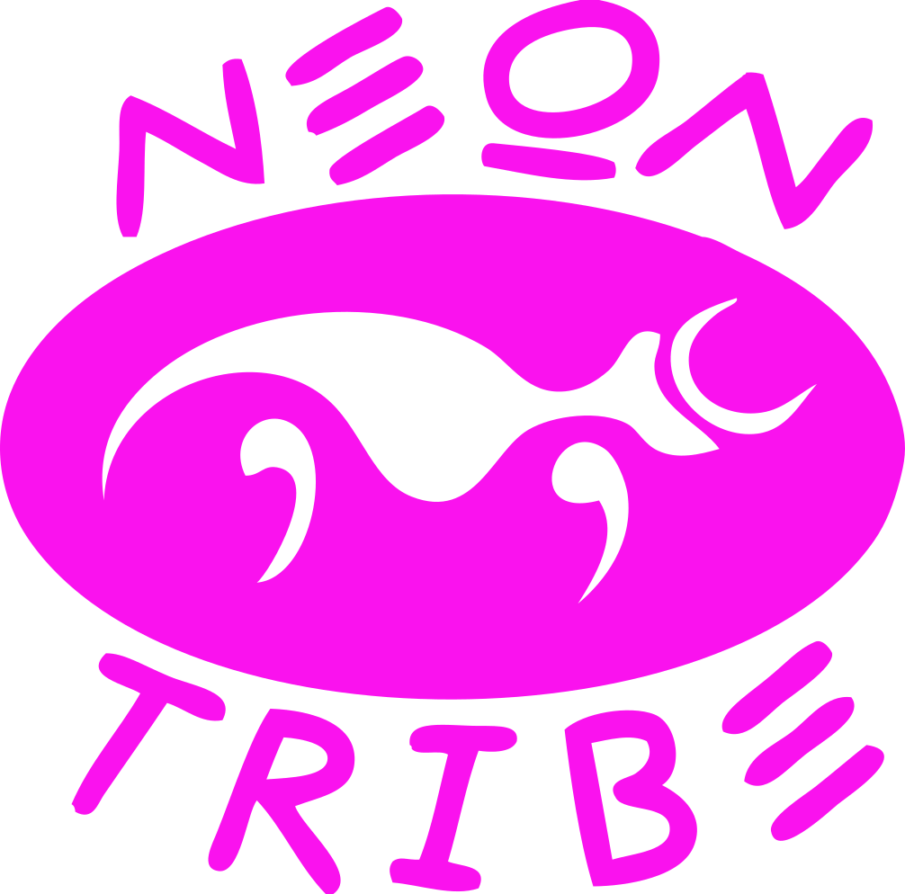
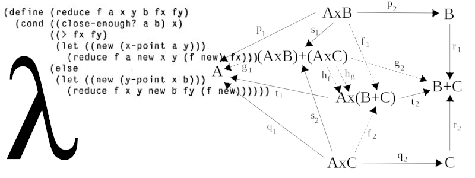
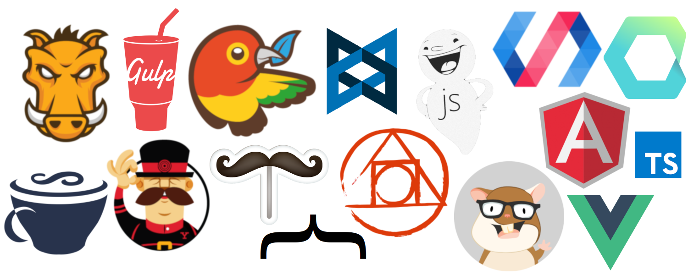
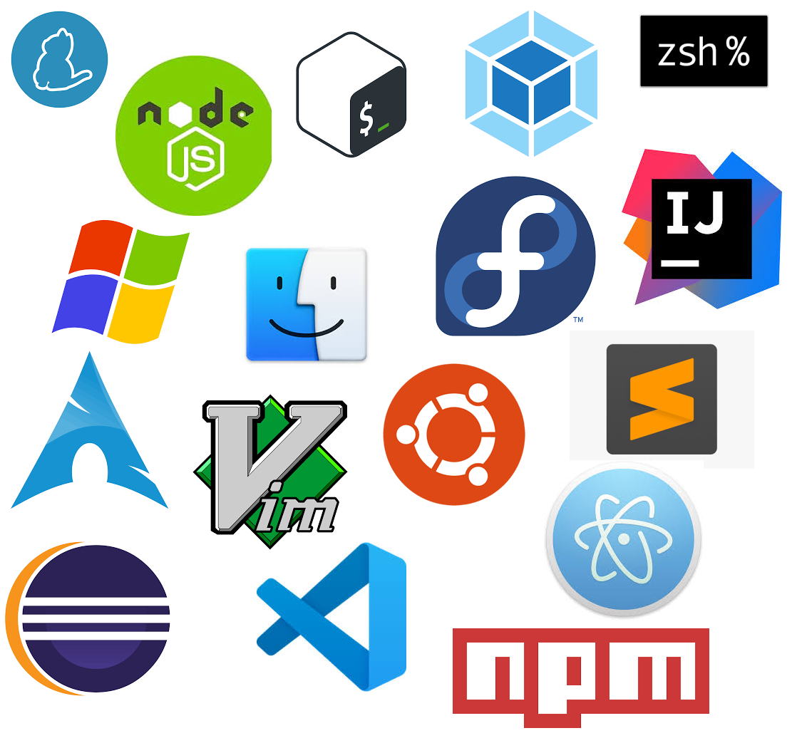
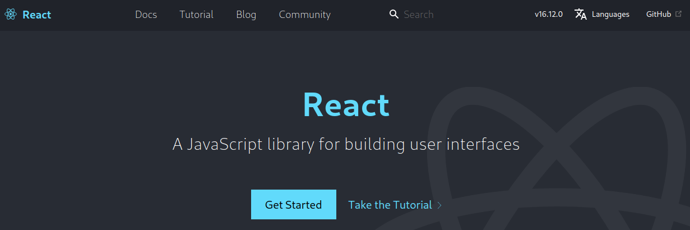
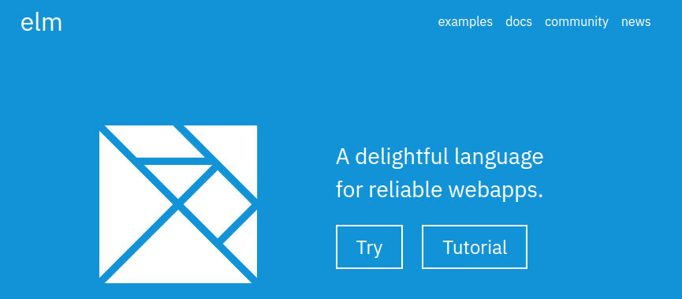
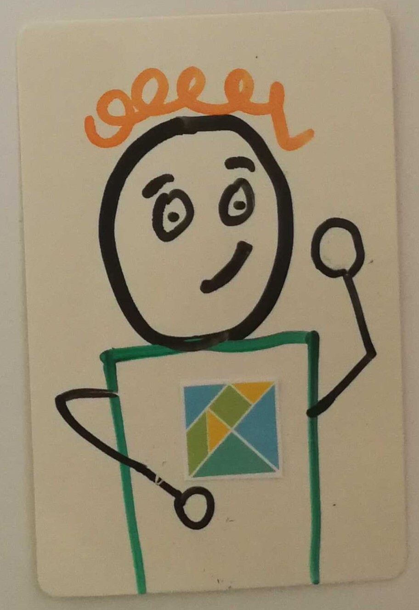
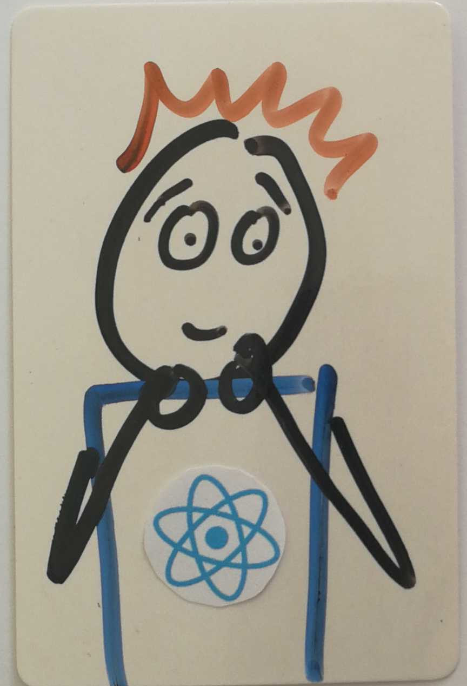
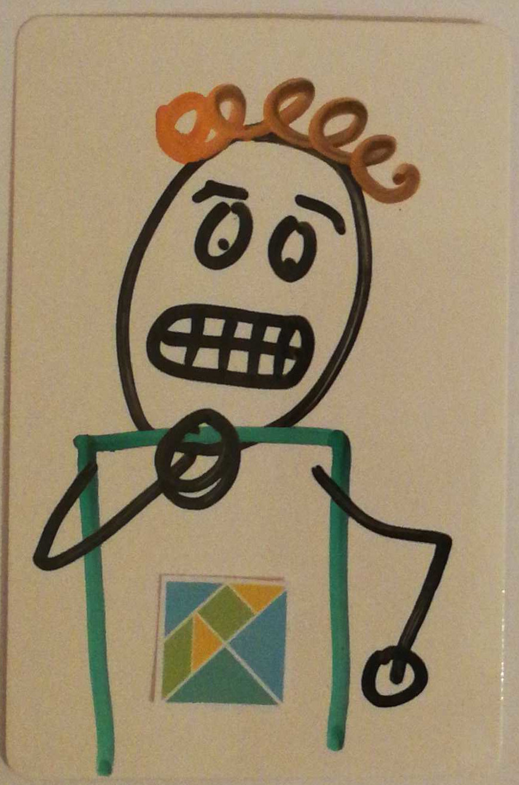
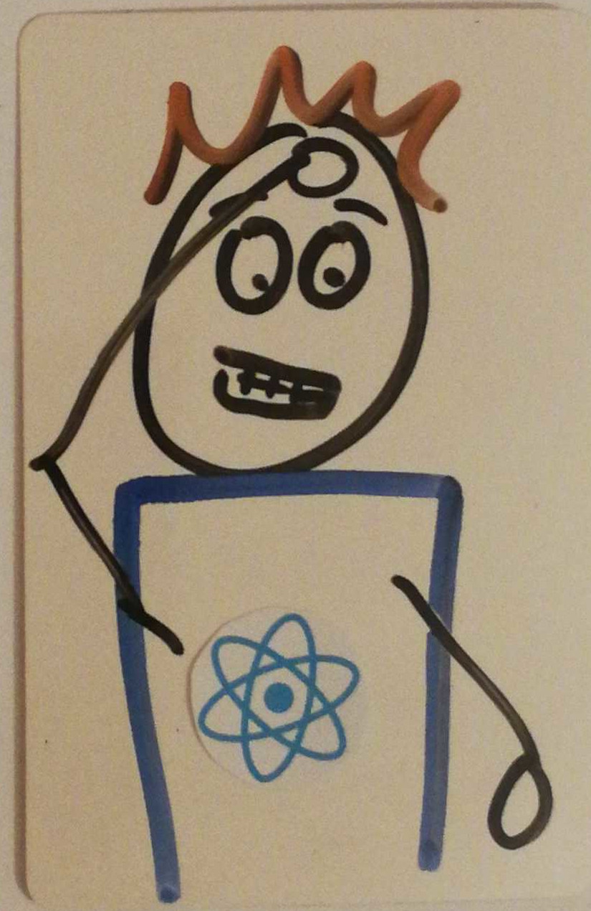

# Healthy Code, Happy People

### An introduction to Elm

---

<!-- .element id="me" data-background="#8fcbdc" -->

## Katja Mordaunt


 
- &nbsp;katja&#64;neontribe.co.uk<!-- .element class="icon-envelop"-->
- &nbsp;@neontribe<!-- .element class="icon-twitter" -->
- &nbsp;katjam<!-- .element class="icon-github" -->
- &nbsp;elmlang: katjam<!-- .element class="icon-slack" -->

Note:
(1 min)
- Developing software in small teams over decade with Neontribe. Work with non-profits to build digital tools that compliment their over-stretched services
- I don't identify as a computer scientist or engineer - I just like using code to make stuff
- not a mathematician nor a category theorist... XXX don't need to know it to write reliable User Interfaces
- I love javascript TICK
- It would surprise my colleagues - running of js - equality, freedom it creates by having a universally supported target as standard on majority of our devices

---

## Assumptions

**Your skills & knowledge** are not the same as mine

**You might think**<!-- .element class="fragment" data-fragment-index="2"-->
- New is fun & old is safe<!-- .element class="fragment" data-fragment-index="2"-->
- Popular is reliable & niche is fragile<!-- .element class="fragment" data-fragment-index="2"-->

**You probably value**<!-- .element class="fragment" data-fragment-index="3"-->
- Safety & efficiency<!-- .element class="fragment" data-fragment-index="3"-->
- Client trust<!-- .element class="fragment" data-fragment-index="3"-->
- Un-stressful collaboration<!-- .element class="fragment" data-fragment-index="3"-->

Note:
(3 min)
- I don't like reading or writing javascript
- TICK: You're probably a lot better at writing javascript than I am - because don't do it very much
- TICK: Might think new tech is fun - but old tech is safer - new to you does not mean new.
- functional 1930's, ML syntax 1973 - React Elm Typescript Webpack 2012/ 2013 - graphql, redux 2015
- You might think popular tech is reliable and niche tech is fragile - carefully engineered specialist equipt
- TICK: Like me, you proably want to write reliable software that you can be proud of
- and feel confident when others collaboate with you on your code

+++

## This talk is not

<!-- .element class="fragment" data-fragment-index="1" -->
<!-- .element class="fragment inline" data-fragment-index="2" -->
<!-- .element class="fragment inline" data-fragment-index="2" -->

Note:
(3 min)
- TICK: A functional programming primer
- TICK: Intended to diss javascript
- Intended to make anyone feel bad about their tools and choices

+++

## This talk is
IMG<!-- .element class="fragment" data-fragment-index="1" -->
<!-- .element class="fragment" data-fragment-index="2" -->
<!-- .element class="fragment" data-fragment-index="2" -->
IMG<!-- .element class="fragment" data-fragment-index="3" -->

Note:
(4 min)
- Asking you to think about what humans are good and what computers are good at
- Exposing some of the benefits of functional, static typing
- Going to make some bad assumptions about react (I don't use it much) XXX
- I am going to tell you a little about why I like Elm and how I think it helps make happier, more productive teams
- but this talk is more about how we can help each other write better code and have better conversations
- It's great that some brain types can process and retain info around complex networks and code connections - but if you are writing inclusive code remember that most of us can't.
- And if you are new to coding or new to the project, you probabably won;t even be aware that the complexity exists.
- Humans are awesome. We have imagination... but that can also lead to complication particularly during a creative collaboration

---

<!-- .element id="app-venture" data-transition="zoom" data-background="#8fcbdc" -->

## A Tale of 2 App-ventures


### New project!

Note:
(5 min)
- A story about a brave team of people who set off down an unknown path. As they go, they reflect on experience of an earlier react project
- A story around a brand new product cycle - but Elm can also be used to add elements to an exisiting js project
- After the initial project is scoped and prototyped, we have choices to make
- What tech stack? Of course includes the frontend - we know react vs. we heard about Elm
- also typescript, angular, reason ml, etc... there are many
- In this story, our team intrigued promises of Elm
- Elm is a language based on functional programming principles that compiles to Javascript and defines an architecture that makes rapid prototyping, evolving and scaling web apps and maintaining a single source of truth easy.
- It's ecosystem is steadily growing & as advertised is a delightful language for reliable webapps, with friendly error messages and no runtime errors, is also for data vizualisation, for 3D graphics

+++

<!-- .element class="stage-card" -->

## Choose and initialise the stack


Note:
- The Elm team is feeling a little guilty, they'll have to find out more.
- If they were using react Excited! They be able to dive in and start scaffolding.
- Common exp. in this room, but Obviously only happens on first Elm project.

+++

<!-- .element class="large-img" -->

Note:
- Contray to popular belief, you don't have to throw out everything you know to switch to a more functional paradigm.
- Many languages have support for functions as first class citizens, so you probably already use concepts without realising
- Elm helps ease you in to it without needing the theory behind it. Understanding comes later.
- More than a language, a community & defines an architecture that helps us write good code
- Lots of big and small companies in all kinds of sectors all over the world are using it in production.
- 5 conferences (Japan, St Louis, Chicago, Paris, Oslo)

+++

### Strings, Math & Lists

```elm
"Hello " ++ "Norwich!"
> "Hello Norwich!" : String
```

```elm
5 / 2
> 2.5 : Float

5 // 2
> 2 : Int
```

```elm
names = ["Alex", "Shaun"]

List.reverse names
> ["Shaun", "Alex"] : List String

List.length names
> 2 : Int
```

Note:
- syntax confusing - Ironically, exp devs seem to have more trouble reading Elm than beginners
- demo that this is not a lisp based syntax
- uses comments, variables, functions, math and logic
- in a REPL XXX
- Concatenate strings with `++`
- Division can be floating point / or integer //
- Lists must contain items of same type

+++

### Tuples & Records

```elm
myFailureTuple = (False, "Oh no!", HomePage)
mySuccessTuple = (True, "Yay!", NextPage)
```

```elm
event = { attendees = 50, name = "nor(DEV):con" }

event.name
> "nor(DEV):con" : String

.name event
> "nor(DEV):con" : String

{ event | attendees = 500 }
> { attendees = 500, name = "nor(DEV):con" }
    : { attendees : number, name : String }
```

Note:
- Tuples are fixed in number of values but can be mixed types
- Records are like objects but type safe
- Get value with dot or as a function
- Update a record XXX 

+++

### Functions!

<pre><code class="language-elm" data-line-numbers="1|2-7|9|10">addTwoString : Int -> Int -> String
addTwoString x y =
    String.fromInt x 
        ++ "+" 
        ++ String.fromInt y 
        ++ "=" 
        ++ String.fromInt (x + y)

addTwoString 2 3
> "2+3=5" : String
</code></pre>

Note:
- The type annotation
- The function definition
- Call the function
- The result is a string

+++

### Logic

```elm
if True then "yes" else "no"
> "yes"
```

```elm
case time of
    Morning ->
        "Hello"

    Evening ->
        "Goodbye"

    Midnight ->
        ""
```

Note:
- if then else has 2 branches determined by boolean
- case statement more than 2 possibilities
- Note that every branch of the case must return the same type

+++

<!-- .element class="stage-card" -->

## Project Boilerplate


<!-- .element class="wonk-img" -->

#### create-elm-app 20,960 lines<!-- .element class="fragment" -->
#### create-react-app 2,652,534 lines<!-- .element class="fragment" -->

Note:
(10 min)
- Elm team wander around exploring carefully - they feel excited - learning something new.
- They've been reassured by the great docs, easy set up and supportive community
- React team feeling powerful! They've got a clean new project to dive into.
- This is going to be the best engineered project ever - now they know what they are doing.
- Not advocate use, but popular way to tear up. Had a hunch about number of lines.
- TICK TICK - not wrong

---

<!-- .element class="stage-card" -->

### Start to make the things


Note:
- The Elm team is feeling cautious. Many patterns are new to them.
- React team bored. Install some linting and build tools. 

+++

- What is this TEA you speak of?
- Domain modeling in Elm


Note:
- From tech exeter talk
- model - your 'state'
- update function like a react redux reducer - unidirectional dataflow 
- view - display
- subscriptions for outside events like time
- 3 started programmes browser, element, etc

+++

- html?

Note:
- From tech exeter talk

+++

- Elm UI? No more css

Note:
(13 min)
- What does team look like?
- Already have some css - can plug it in
- accessibility library
- define responsive behaviours in a more obvious / logical way

+++

<!-- .element class="stage-card" -->

### Initial domain model


Note:
(15 min)
- Elm team exhilerated.
- They've figured out how the architeture works 
- React team Huffy they've been arguing a little and coding over each other's work.
- Both teams have come to an agreed model

---

<!-- .element class="stage-card" -->

## The plan hasn't worked


Note:
(17 min)
- Reach limits of the initial model
- Elm Team confident - they meet a dead end but they trust the compiler
- React Team annoyed - they meet a dead end and fear a refactor

+++

## Refactor time!

+++

## What's so great about static typing?

Note:
- Elm can make more complex apps safer but it's also a solid foundation for any UI

+++

<!-- .element class="stage-card" -->

## There will always be challenges, misunderstandings and mistakes


Note:
(18 min)
- The 2 teams meet and find they've had same challenges
- Elm team still confident. They can see they have good patterns.
- React team confident. They started to trust each other and have a new, more robust model.
- Made me reflect that we need to learn to trust each other's tech - and knowlegde & ability to evaluate and make choices in good faith

---

<!-- .element class="stage-card" -->

## Build & polish


Note:
(20 min)
- Elm Team Excited - they start writing the functionality they need
- React Team Excited - they know what they need, start installing libraries.

+++

## Holes start appearing

Notes:
- React memories of discovering how to manage state and lifecycle methods.
- Benefits of pure functions

+++

<!-- .element class="stage-card" -->

## The alpha has landed!


Note:
(22 min)
- Elm team feeling confident. Their code feels robust. They don't have as many features as they wanted and some of them are a little rough... 
- React team feeling guilty. They delivered lots of features but less tests than they should have written and they are aware of some cracks.

---

<!-- .element class="stage-card" -->

## Initial release




Note:
- The Elm team feeling proud and confident to go through the features & code with client
- The React team are feeling cautious - they realise some of their features are fragile

+++

- features (made it & not)
- share with clients
- mutable objects
- elm storytelling

+++

<!-- .element class="stage-card" -->

## Try it out & show it off


Note:
(25 min)
- Testing with users and getting acceptance signed off by client
- The elm team proud of what they have and all works as expected
- The React team are annoyed, they realise they don't need some of the features they built after all

---

<!-- .element class="stage-card" -->

## Making changes




Note:
- Leads can step back now architecture is done
- Elm team feel anxious about adding a new feature
- React team confident - but then things start going wrong unexpected effects

+++

- Need ports?
- Code review strategy
- Dive in and change something (would you let and intern do that?)
- Alter elm-ui vs css

+++

<!-- .element class="stage-card" -->

## Made some tweaks and added a couple features


Note:
(28 min)
- Elm team feel proud, they added the features and nothing broke
- React team feel anxious, they've had to patch something at the last minute

---

<!-- .element class="stage-card" -->

## Maintenance


Note:
- The project hasn't been worked on for a while
- Security patches
- A new feature request
- Elm team confident they make the changes and follow the compiler
- React team feeling confused and not sure how to approach.
- The things they try feel fragile

+++

- Unbreakable means no stress
- Project grows, people churn
- Read code
- Amend code
- js libraries moved on - Elm no undeclared breaking changes

Note:

+++

<!-- .element class="stage-card" -->

## New feature added to mature code base




Note:
(33 min)
- Elm team feel proud, even though they weren't original it feels like the thing they added is sound
- React team feel lucky and discuss a complete rewrite if ever they are asked to add another feature

---

<!-- CONCLUDE AND SUMMARY -->

## Now what?

If programming is your job, it isn't supposed to be fun...

IMG<!-- .element class="fragment" data-fragment-index="1"-->

but it should make you feel proud.<!-- .element class="fragment" data-fragment-index="1"-->


Note:
(34 min)
- Our ultimate goal is reliable apps
- Your job should not include unneccessary stress
- If you are writing code that's hard for some of your team to understand, you won't feel proud.
- We have a finite amount of time. Try to spend it building, testing and designing features; not discovering, discussing and fixing bugs.

---

<!-- .element id="thanks" data-background="#8fcbdc" -->

## Thank you


- &nbsp;katja&#64;neontribe.co.uk<!-- .element class="icon-envelop"-->
- &nbsp;@neontribe<!-- .element class="icon-twitter" -->
- &nbsp;katjam<!-- .element class="icon-github" -->
- &nbsp;elmlang: katjam<!-- .element class="icon-slack" -->

Note:
(35 min)
- Support of Neontribe and the Elm community
- Come find me later with questions or get in touch
