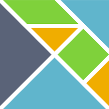
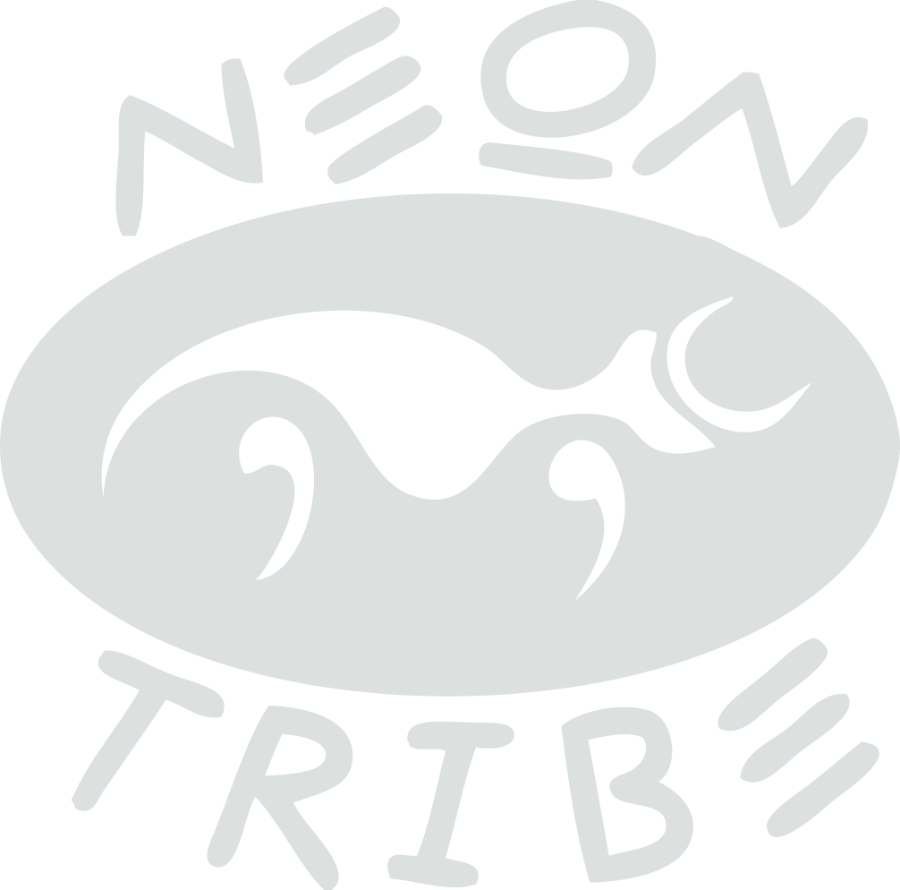

# Healthy Code, Happy People

---

## Katja Mordaunt

Note:
- Developing software in small teams over decade with Neontribe. Work with non-profits to build digital tools that compliment their over-stretched services
- also raising children for a 1/4 century & dabbled film industry
- Going to share some practical tips - and talk about how and why I think Elm helps make happier, more productive teams

---

## A Tale of 2 Appventures

New project!

<!--.element class="fragment" -->
<!--.element class="fragment" -->

Note:
- Funtional was a safe / predictable space
- Someone mentioned Elm

+++

## Slide 2 

Note:
- syntax confusing - Ironically, exp devs seem to have more trouble reading Elm than beginners
- Made me reflect that we need to learn to trust each other's tech - and knowlegde & ability to evaluate and make choices in good faith
- I tried to explain that - yes Elm can make more complex apps safer but it's also a solid foundaiton for any UI

+++

## What does it mean?

If programming is your job, it isn't supposed to be fun...

but it should make you feel proud.<!-- .element class="fragment" -->

Note:
- blah blah

---

Thank you
